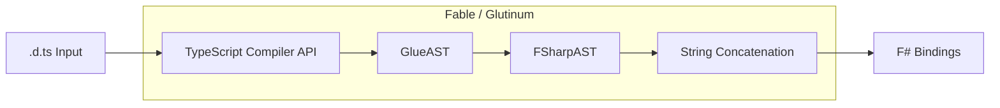
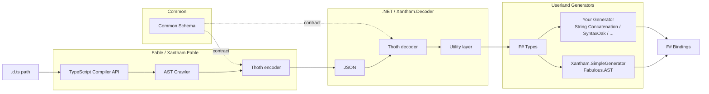

# Xantham

> A schema-driven TypeScript → F# bindings generator.

Xantham is a hard fork of [Glutinum](https://github.com/glutinum-org/cli) that tackles the TypeScript-to-.NET bindings problem with a fundamentally different approach. Instead of a single end-to-end pipeline, Xantham separates concerns into **extract**, **encode/decode**, and **generate** phases across Fable and .NET boundaries. This increases resilience to change and enables flexible, userland generator strategies.

> **Resilience to change** is a core design goal. With the emergence of the TypeScript GO compiler, Xantham can adapt by updating only the encoder (e.g., to a TSGO-native implementation) while the decoder and all downstream generators remain unchanged — as long as the common schema stays stable.

---

## How It Works

### Glutinum (reference)



### Xantham



The common schema is the single hand-off point. Generators consume `Xantham.Decoder` and never touch the extraction pipeline.

---

## Modules

| Module | Role |
|--------|------|
| **Xantham.Common** | Shared type schema (`Common.Types.fs`) — the contract between extractor and generators. Not compiled as a separate assembly; included directly by `Xantham.Fable` and `Xantham.Decoder`. |
| **Xantham.Fable** | TypeScript extractor — compiled to JS via Fable. Crawls `.d.ts` files via the TSC API (ts-morph) and emits JSON conforming to the common schema. |
| **Xantham.Fable.Core** | Minimal Fable bindings stub. Provides F# representations of TypeScript type-system idioms (`keyof`, indexed access types, heterogeneous property unions). See [Xantham.Fable.Core README](src/Xantham.Fable.Core/README.md). |
| **Xantham.Decoder** | .NET library. Decodes the JSON schema into strongly-typed F# structures. Provides a utility layer for convenient generator consumption. |
| **Xantham.SimpleGenerator** | Example generator — demonstrates a minimal end-to-end flow from decoded schema to F# bindings using Fabulous.AST. |

---

## Current Status

| Component | Status | Notes |
|-----------|:------:|-------|
| **Schema** (`Xantham.Common`) | 🟡 Beta | Overload support added (`IOverloadable` / `TsOverloadableConstruct<'T>`). Schema considered near-stable; any breaking change requires a coordinated update across all layers. |
| **Reader** (`Xantham.Fable`) | 🟡 Beta | Handles large hierarchies (e.g. solid-js). Stack-based traversal avoids JS stack overflows. Post-traversal overload merging by `TypeKey`. Import evaluation for barrel-file-internal re-exports still pending. |
| **Decoder** (`Xantham.Decoder`) | 🟡 Beta | JSON decoding is functional. Utility API is still being refined based on anticipated generator consumption patterns. |
| **Generator** (`Xantham.SimpleGenerator`) | 🟠 In progress | Structural output works. Overload rendering (enumerating `TsOverloadableConstruct` variants) not yet implemented. |

### Reader checklist

- [x] Read `.d.ts` files via the TypeScript Compiler API
- [x] Crawl the AST and extract type information across multiple files
- [x] Extract barrel file exports
- [x] Cache computations; resilient to recursive type references
- [x] Stack-overflow protection (stack-based traversal — Node.js has no TCO)
- [x] Resolve types via the type checker (e.g. template strings → flat string enums)
- [x] Encode extracted data into the common JSON schema
- [x] Merge overloadable declarations that share a `TypeKey` (`FunctionDeclaration`, `Method`, `Constructor`, `CallSignature`, `ConstructSignature`)
- [x] Inline `TypeParameter` identity (`SelfKey`) to preserve references in generic signatures
- [ ] Correct import-statement evaluation for types re-exported through barrel files
- [ ] Flatten duplicate transient types (anonymous generic parameters sharing a name)

### Decoder checklist

- [x] Decode reader output into F# types
- [x] Utility organisation of output
- [x] Dangling-reference / missing-type diagnostics
- [ ] Automated test suite (tracked in #9)
- [ ] Public API stabilisation and documentation (tracked in #10)

---

## Why Xantham?

- **Schema-driven** — extraction and generation are decoupled by a versioned JSON contract.
- **Technology-agnostic boundary** — the encoder can be replaced (TSC → TSGO, or a standalone Go encoder) without touching decoders or generators.
- **Userland generators** — implement your own generator using `Xantham.Decoder`. Choose your style: Feliz vs Oxpecker, interfaces vs classes, Fabulous.AST vs string concatenation.
- **.NET-native generation** — opens future avenues such as type providers (exploratory).

> Note: the extractor recursively follows all referenced types from a `.d.ts` file's exports. Depending on your use case this may be beneficial (completeness) or something to scope carefully.

---

## Quick Start

```bash
# 1. Extract — compile the Fable extractor and run it against your .d.ts
npm run prestart          # dotnet fable --cwd src/Xantham.Fable
npm start                 # node src/Xantham.Fable/Program.fs.js <path/to/index.d.ts>

# 2. Decode & Generate — run the example generator against the emitted JSON
dotnet run --project src/Xantham.SimpleGenerator
```

1. Point `Xantham.Fable` at your `.d.ts` file to extract and encode the schema as JSON.
2. Use `Xantham.Decoder` in .NET to decode the JSON into strongly-typed F# structures.
3. Implement a generator (or use `Xantham.SimpleGenerator` as a reference) to produce F# bindings.

---

## Development

```bash
# Watch mode (Fable + Node)
npm run watch

# Signal unit tests (standalone Fable script)
npm run test:signal

# .NET build and tests
dotnet build
dotnet test src/Xantham.SimpleGenerator.Tests
```
