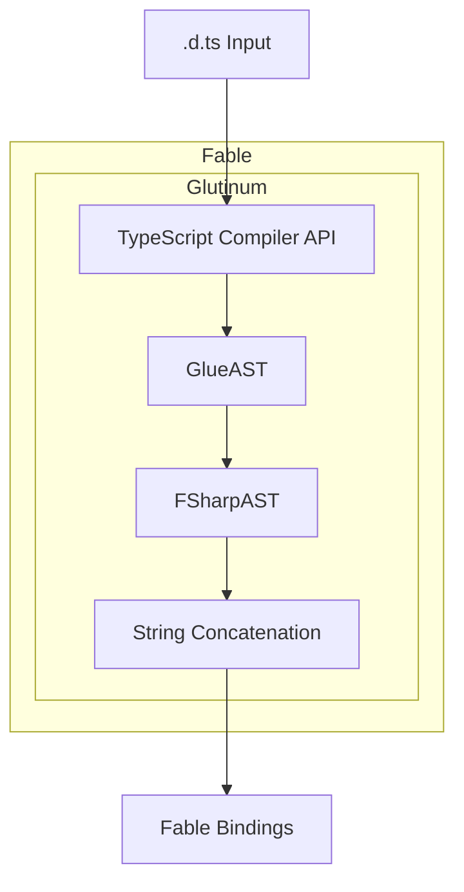
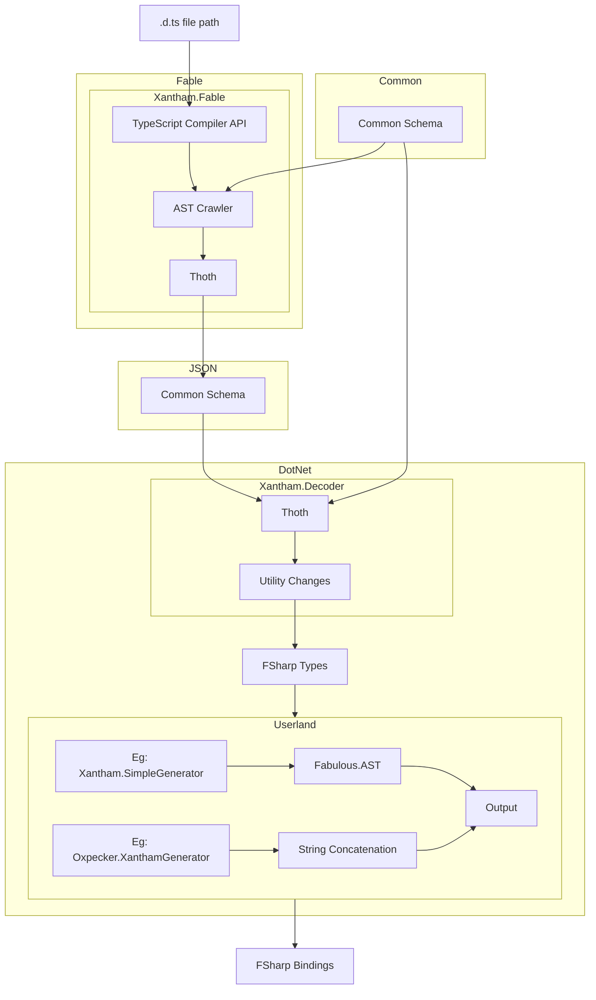

# Xantham

Xantham is a hard fork of Glutinum that tackles the TypeScript-to-.NET bindings problem with a fundamentally different, schema-driven approach. Instead of producing bindings directly in a single end-to-end pipeline, Xantham separates concerns into extract, encode/decode, and generate phases across Fable and .NET boundaries. This design increases resilience to change and enables flexible generator strategies.

> Resilience to change is a key concern. With the emergence of the TypeScript GO compiler, we can adapt by updating only the encoder (e.g., to a TSGO‑native implementation, or by providing a standalone GO encoder). The decoder and downstream generators remain unchanged as long as the common schema stays stable.

### Glutinum Pipeline

### Xantham Pipeline

---

Xantham provides:
- Extraction of TypeScript declaration (`.d.ts`) information via the TypeScript Compiler (TSC) API.
- Encoding of the extracted data into a common JSON schema and a corresponding .NET decoder.
- A clear hand‑off point where .NET tools can shape and generate bindings.

This enables managing the extracted information within the .NET ecosystem and leveraging tools such as `Fantomas.SyntaxOak` and `Fabulous.AST` to generate bindings. Authors can build their own generators (reusing `Xantham.Decoder`) to produce bindings in their preferred style (e.g., Feliz vs. Oxpecker, interfaces vs. classes, string concatenation vs. AST‑based), without modifying the extraction pipeline.

> Managing the extracted information in .NET also opens future avenues such as employing type providers. This remains exploratory and may require significant design considerations.

## Xantham.Fable

Bindings to the TypeScript compiler and the module responsible for crawling `.d.ts` files and extracting type information via the TSC API. It outputs data conforming to the common schema.

## Xantham.Common

The common type system for the schema produced by `Xantham.Fable`. This is not a compiled library; it serves as a shared contract included by other modules to ensure schema consistency.

## Xantham.Decoder

A .NET decoder that uses `Xantham.Common` to read the encoded schema. Generators can:
- Consume the raw decoded data directly; or
- Use a utility layer that repackages the data into a higher‑level, convenient API for generation.

# Generators

Generators can be implemented using any .NET toolset. The core principle is separation of concerns: extraction and transport are independent from generation. This makes it straightforward to experiment with different generation strategies.

Note: the extractor will recursively crawl all referenced types from a `.d.ts` file’s exports. Depending on your use case, this may be either beneficial (completeness) or something to scope carefully.

## Xantham.SimpleGenerator

An example generator demonstrating a minimal end‑to‑end flow from decoded schema to F# bindings.

## Quick Start

1) Provide the path to your `.d.ts` file(s) to `Xantham.Fable` to extract and encode the schema.
2) Use `Xantham.Decoder` in .NET to decode the JSON schema into strongly‑typed data.
3) Implement or use an existing generator (e.g., `Xantham.SimpleGenerator`) to produce F# bindings via your preferred approach (AST‑based or string concatenation).

## Why Xantham?

- Schema‑driven contract between extraction and generation.
- Technology‑agnostic encoder/decoder boundary that can evolve (e.g., TSC → TSGO) without disrupting consumers.
- Freedom to design generators that match your style and tooling preferences.

---

# Current Status

| Function | Module | Status | Notes                                                                                                                                                                                                      |
|:---------|:--|:------:|:-----------------------------------------------------------------------------------------------------------------------------------------------------------------------------------------------------------|
| Schema | Xantham.Common |   🟡   | Beta                                                                                                                                                                                                       |
| Reader   | Xantham.Fable |   🟡   | Beta                                                                                                                                                                                                       |
| Decoder | Xantham.Decoder |   🟡   | The decoder naturally functions in regards to parsing the JSON, but utility methods and functions are still being considered and reworked pending on what I find would likely be used widely by consumers. |
| Generator | Xantham.Generator |   🔴   | Needs to be rejigged to the new reader standards.                                                                                                                                                          |

>