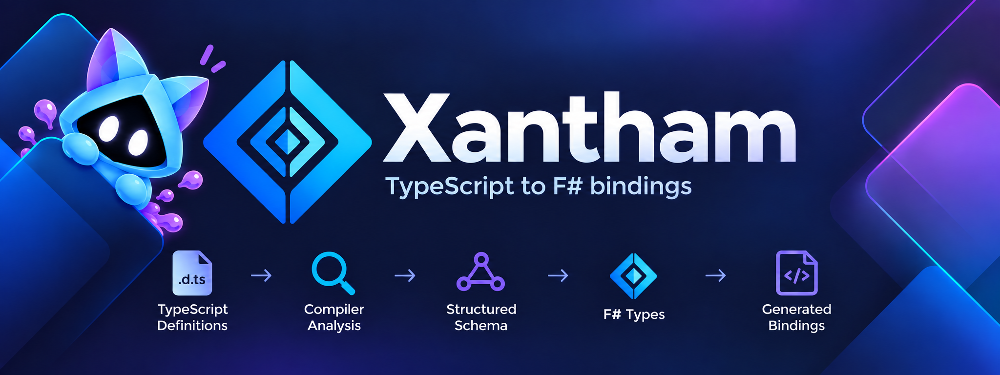

<div>
  


</div>

Xantham is a `TypeScript` → `F# Fable bindings` generator, built on the TypeScript 7 compiler's own API server.
Pure F# consumer and producer.

The TypeScript 7 compiler API protocol is generated from the source, and distributed independently as 
`Xantham.TypeScript.Wire`.

---

## Xantham

```bash
# Install dotnet tool
dotnet tool install --global xantham

# View help line
xantham --help

# Cache the pinned typescript compiler
xantham tsc init
# Generate bindings
xantham generate node_modules/typescript_package
```

The `xantham` tool can be configured using a `.json` file. The schema can be pointed
to reference the repository schema, or generated to match the version of the tool
you are using:

```bash
xantham schema

xantham schema --output xantham.schema.json
```

[See the Docs](https://shayanhabibi.github.io/Xantham) for more information.

> [!NOTE]
> The generator implementation is packaged with the tool, and is not distributed independently.
> You are, however, free to fork/clone the repo and make an implementation from the generator
> in line with the provided license.

---

## Xantham.TypeScript.Wire

The `tsc --api` protocol that is used by `xantham`. It is generated from the source, with clear
instructions provided in `AGENTS.md` and our associated documentation on how to generate it for
a specific version of the compiler, or to update it. The instructions are specific only for
those parts of the protocol that are **not** generated.

### Sync vs Async

The `tsc` async api uses a different messaging envelope with a higher memory footprint. The performance
at design time between using the sync api with `batchRequests` and the async api was not significant, but
the memory efficiency was.

For this reason, we generate against the synchronous api, and use a `MailboxProcessor` to batch requests
asynchronously in-process.

### Usage

```bash
dotnet add package Xantham.TypeScript.Wire
```

The wire protocol and its usage are explained [in the docs](https://shayanhabibi.github.io/Xantham/wire/).
You can also observe its usage from our implementation of the generator.

---

## Support Packages

These are packages distributed and maintained by the authors, which are either required
for the generated output, or warrant a centralised implementation (ie `@types/node`).

|Package|Required|Description|
|---:|:---:|:---|
|`Xantham.Fable.Core`|✅|Utility types and functions that improve interoperability and representation of some TypeScript types.|
|`Xantham.Fable.Core.TS`|✅|The typescript library `dom` and `es*` bindings.|
|`Xantham.Fable.Node`||Bindings to `@types/node` - `~300k loc`.|

---

## See the Docs

[Docs are generated from the source.](https://shayanhabibi.github.io/Xantham)

[//]: # (---)

[//]: # ()
[//]: # (## Donate)

[//]: # ()
[//]: # (If you want to support the authors, you can [donate]&#40;https://github.com/sponsors/shayanhabibi&#41;.)

[//]: # ()
[//]: # (## Sponsor)

[//]: # ()
[//]: # (If you want to sponsor a particular direction of)

[//]: # (the library, you can raise an issue, or [email]&#40;mailto:shayan.habibi01@gmail.com&#41;)

[//]: # (the author.)

[//]: # ()
[//]: # (---)
