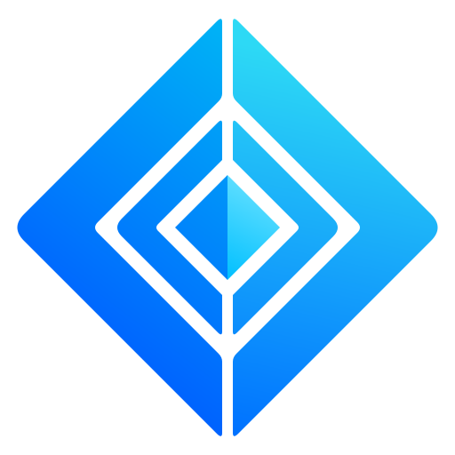

# Xantham resource pack

Open `index.html` for the visual catalog. All six supplied PNGs are preserved byte-for-byte under descriptive names. Version 1.2.1 provides four editable SVGs, 51 named mascot viewports, two banner views, a workflow banner, palette tokens, and brand references.

## Mascot tile correction — 1.2.1

All 51 viewports now follow the actual uneven placement of the figures. The previous equal-column divisions have been removed. The peek and wave tiles additionally use polygon clips to keep each character's nearby details with the correct tile. When consuming `frames.json` directly, apply `clipPolygon` when present; the supplied CSS already does this.

Rendered inspection sheets for all 51 tiles are in `previews/`. The source image is unchanged. The laptop and seated-profile mascots share a connected gum base in the source, so their tiles divide that base at the boundary. These remain source-sheet sprites with white backgrounds, not individually redrawn transparent cutouts.

## Nacara documentation theme — added in 1.2.0

See `nacara/README.md`. Copy `nacara/css/` to your documentation project, then register `Site.stylesheet "css/xantham.css"`. Includes light/dark tokens, syntax colors, small component refinements, and SVG assets. Targets the current F# Nacara.Theme.Default API. Existing site build and browser rendering have not been verified; see the included validation notes.

## Vector assets — added in 1.1.0

| File in `assets/vectors/` | Use |
| --- | --- |
| `xantham-logo-electric-cyan.svg` | Vivid banner-inspired blue/cyan logo; latest color treatment. |
| `xantham-logo.svg` | Blue-to-sky gradient using #007BFF and #73DBFF. |
| `xantham-mascot-head.svg` | Cyan and violet faceted mascot icon. |
| `xantham-mascot-head-midnight.svg` | Monochrome #1A1B2E mascot icon with transparent cutouts. |

Both diamond logos now share a larger 118-unit center diamond in a 512-unit viewBox. The straight diagonal gaps between nested shapes match (23 / √2 units). Rounded corner transitions and the vertical split are intentional. Gradients are defined in SVG rather than sampled from raster edges. Each SVG has a transparent background; use the midnight mascot on a light background.

```html


```

## Use on the web

Copy `assets/`, `web/`, and `tokens/` together, preserving their relative paths.

```html
<link rel="stylesheet" href="web/xantham-assets.css">
<link rel="stylesheet" href="tokens/palette.css">
<span class="xantham-mascot xantham-poses-celebrate"
      role="img" aria-label="Xantham mascot celebrating"></span>
<div class="xantham-banner xantham-banner-dark"
     role="img" aria-label="Xantham"></div>

```

Use `aria-hidden="true"` instead of role/label for purely decorative mascots. Exact frame coordinates and dimensions are in `assets/frames.json`. CSS class names are shown in the catalog. Mascot viewports exclude sheet captions and retain the original opaque white background. They are CSS sprites, not individual transparent PNGs or animations. At native sizes most figures are approximately 140–165 pixels high; avoid enlarging them substantially.

## Brand usage

The supplied guide specifies Midnight #1A1B2E, Xantham Blue #007BFF, Gum Violet #B794FF, Sky Blue #73DBFF, Ice #DDEBFF, Mist #F6F3FF, Slate #94A3B8, and White #FFFFFF. Tokens reproduce the printed hex labels rather than sampled shaded pixels.

Use the supplied diamond logo and wordmark from the banner for this set. Preserve proportions and colors. The guide requests clear space equal to the height of its X marker. Keep the mascot's hood, pointed ears, dark face, bright eyes, and gum motif consistent. Tagline: “Same types. Different possibilities.” The banners have no tagline; the workflow banner retains its descriptive subtitle.

## Source quality and scope

`reference/brand-guidelines.png` is the main reference for this pack. `reference/alternate-brand-concept.png` includes a different wordmark and older copy, so it is retained as a concept reference. `reference/alternate-transparent-atlas.png` has transparency but also visible speckling and halos; it is retained for provenance and is not used by the CSS sprites. All other supplied images are opaque.

`assets/banner-light-dark.png` holds two 2048 × 384 banners in a single 2048 × 768 image; the CSS selects each half. `assets/workflow-banner.png` is 2048 × 768. The clean mascot atlas is 1536 × 1024 and contains 51 figures. One unlabeled seated profile has the descriptive identifier `actions-side-sitting`; other identifiers follow the supplied captions.

The SVGs are newly drawn vector assets, not raster images embedded in SVG containers. The full-body mascot sheet remains raster, with an opaque background. No font file or clean individual transparent full-body sources were supplied. This pack does not assign a new license to the artwork. See `manifest.json` for original filenames, dimensions, and SHA-256 checksums.
